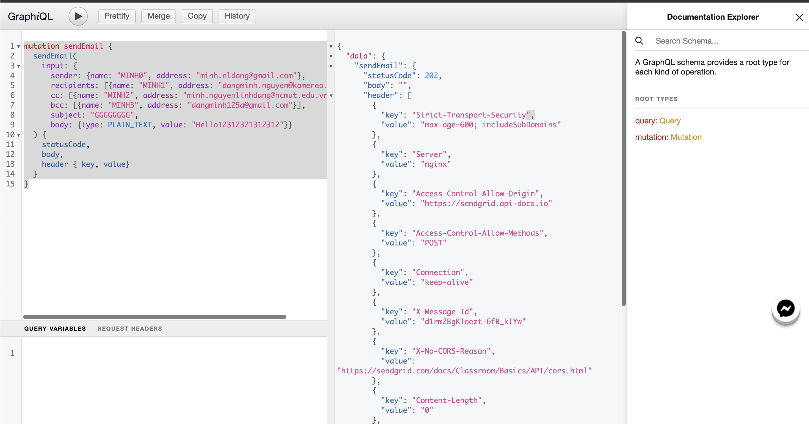
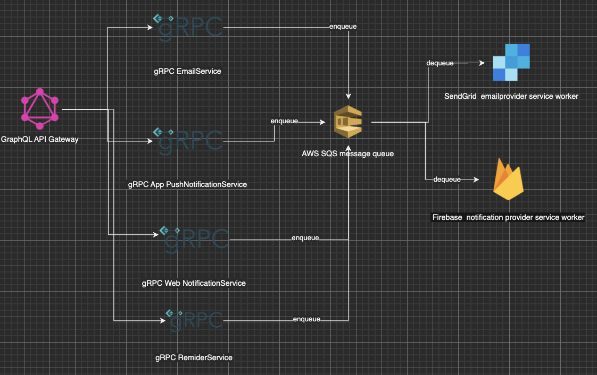

# EmailService

## Functions
A service that accepts the necessary information and sends emails. It should provide an abstraction between two different email service providers. If one of the services goes down, your service can quickly failover to a different provider without affecting your customers.

Example Email Providers:
- SendGrid - Simple Send Documentation
- Mailgun - Simple Send Documentation
- SparkPost - Developer Hub
- Amazon SES - Simple Send Documentation

All listed services are free to try and are pretty painless to sign up for, so please register your own test accounts on each.

## Tech Requirement
- It should be deployed as a service (graphQL server) to be callable
  + http://<domain>/graphiql
- Scalable to consume requests in parallel

## Architecture
- Kotlin Spring Boot / Kubernetes
  + why not Lambda?: frequent DB access, storage / Memory Limit might be annoying in the future.  As long as we use k8s, scalability are not limited.  We might want to think about splitting components, or to use Knative, Kubeless. etc.

## Project Structure
This Gradle project is a multi-project repository.

| Name            | Description                                                                                                                                                                                   | Spring Dependencies |
|-----------------|-----------------------------------------------------------------------------------------------------------------------------------------------------------------------------------------------|---------------------|
| domain-models   | This define domain models. The business logic should be implemented in this project.                                                                                                          | No                  |
| infrastructures | This handles the external interaction like DB, GoogleSheet, Auth0, and etc. Within this project, protobuf message, library exposing data structure should be converted into the domain models | Yes                 |
| features        | This should implement use cases using infrastructures & domain-models. That is most of the implementation is Command & CommandHandler                                                         | Yes                 |
| applications    | This should include the thin layer to run an application and application specific logic like GraphQL or background workers                                                                    | Yes                 |

**applications**
Each subproject is a Spring Boot application under this project. It should contain logic specific to each application. For example, all the files under vn.kamereo.internalservice.web will be moved to :applications:graphql-api-service. This should not have any command classes, use case classes.

**domain-models**
This project contains all the business logic and the defined class must be POJO/POKO. This project should not depend on Spring Framework. We should define the following classes in this project.

entity/value objects
repository interface, implementation should be in infrastructure project
service interface, implementation should be in infrastructure project
potentially factory class
We must write a unit test for this project as it should contain the important business logic.

**infrastructures**
This project contains implementation classes for interfaces defined in domain-models. It can be a repository, grpc service. 3rd party services should be in libraries

Unit test for this project is recommended but not a must. In general, it's better to test as an integration test.

**features**
This project contain use case impelmentation classes like Command & CommandHandler. It also includes some internal business logic specific to the features.

## Application settings

#### 1. Environmental Variables

| Name                                         | Description                                                                                                          |
|----------------------------------------------|----------------------------------------------------------------------------------------------------------------------|
| APP_ENV                                      | for debug, logging on localhost or to set up spring-active-profile when deploy (usually in value of local, qa, prod) |
| SENDGRID_API_KEY                              | your sendgrid secret api key                                                                                         |

#### 2. Requirement
- Install this kubectl version (v.1.19.1)
- gcloud cli
- Java 11


## Specification
### GraphQL schema
Email service definition

```graphql
input EmailContact {
  name: String!
  address: String!
}

enum EmailContentType {
  PLAIN_TEXT,
  HTML
}

input EmailBody {
  type: EmailContentType!
  value: String!
}

input SendEmailInput {
  sender: EmailContact!,
  recipients: [EmailContact!]!,
  cc: [EmailContact!]!,
  bcc: [EmailContact!]!,
  subject: String!,
  body: EmailBody!
}

type ResponseHeader {
  key: String!,
  value: String!
}

type SendEmailResponse {
  statusCode: Int
  body: String
  header: [ResponseHeader]
}

type Mutation {
  # Email
  sendEmail(input: SendEmailInput!): SendEmailResponse
}
```

### Sample GraphQL query and mutation
<details>
  <summary>sendEmail mutation</summary>

```graphql
mutation sendEmail {
  sendEmail(
    input: {
      sender: {name: "MINH0", address: "minh.nldang@gmail.com"},
      recipients: [{name: "MINH1", address: "dangminh.nguyen@kamereo.vn"}],
      cc: [{name: "MINH2", address: "minh.nguyenlinhdang@hcmut.edu.vn"}],
      bcc: [{name: "MINH3", address: "dangminh125a@gmail.com"}],
      subject: "GGGGGGGG",
      body: {type: PLAIN_TEXT, value: "Hello12312321312312"}}
  ) {
    statusCode,
    body,
    header { key, value}
  }
}
```
</details>



## New Hi-Level Features and Design (will have in the up-coming version)
- EmailService provides an endpoint to enable message queues from other services
- EmailService can extend to a CRM System that sends any type of notification: email, push notification, desktop notification, SMS, Zalo, FB, etc
- EmailService can manages notification status: to show “read“ or not yet, to send reminder
- EmailService can send emails/notification by multiple options: scheduling, triggering, fixed time, batch, etc
- Template customize. suppliers can have their own push / email message templates 

refer to this diagram (or see in CrmServiceDiagram.io file)


